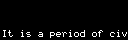

OLED gif generator for Steelseries keyboards
============================================

This tool generates anim GIFs that can be outputted on the OLED display
of Steelseries keyboards. It creates a scrolling / repeating animation
from any string input.

# Samples

Star Wars crawl text:

Bits:

Math:

Assembly (from MS-DOS source code):

# Character map for escape sequences

The character set is from the 1982 Kaypro II machines. (I've extracted it from the video ROM.)
The input text can contain escape sequences, for example:

    \001 + \002 = \007

Use them if one of the characters you typed doesn't render properly, or if you would like to use a special character.

# Usage

First install the `.net core` runtime environment, then just pass the
path to the text file as the first parameter, when executing the app
in the command line:

    dotnet run samples/bits.txt

It will create a file in the same folder and with the same name but with '.gif' extension.
